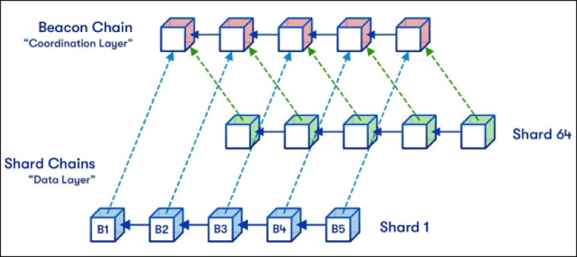

# What is Sharding?

Sharding is a network architecture that enables parallel processing to achieve increased transaction throughput and greater performance. It involves breaking the network into smaller, more manageable pieces called "shards." Each shard processes a portion of the network's transactions independently, thus allowing for parallel processing and increasing the network's overall capacity.

Sharding helps mitigate the performance challenges that unsharded blockchain networks face as they become popular.

# What are the different types of Sharding?

| Network Sharding  | Transaction Sharding      |  Data Sharding | State Sharding|
|:----------|:-------------|:------|::-------|
| Operates Independently | Store entire block chain | Data partitioned into parts |Blockchain state divided into segement|
| Has its own consesus algorithim | Process transaction assinged to the shard   |  Store a part of data | Each shard maintains a segement  |
| Has own ledger & transaction pool| Validate transaction assigned to the shard |   Maintain a part of data | Reduce computational requirement|
|Process more transactions| Cross shard transction requires additional step | Fast data access and retrieval|  Esay to participate   |

1. **Network Sharding:**  Network sharding involves partitioning the nodes in the blockchain network into smaller, interconnected groups called shards. Each shard is responsible for processing and validating a subset of the transactions, as well as storing a portion of the blockchain's state. By distributing the workload among multiple shards, the network can process more transactions concurrently and achieve greater throughput. In network sharding, each shard operates independently, with its own consensus algorithm, ledger, and transaction pool. However, they still communicate with one another to maintain the overall security and integrity of the network. Cross-shard communication is facilitated through a mechanism that allows shards to exchange information and synchronize their states.

2. **Transaction Sharding:** In transaction sharding, the nodes in the network still store the entire blockchain, but they only process and validate the transactions assigned to their shard. Cross-shard transactions require additional steps, such as a two-phase commit protocol, to ensure consistency and maintain the security of the network.

3. **Data Sharding:** In data sharding, the actual data stored on the blockchain is partitioned into smaller pieces, with each shard responsible for storing and maintaining a part of the data. This helps alleviate the storage burden on individual nodes and enables faster data access and retrieval.

4. **State Sharding:** State sharding involves dividing the blockchain's state (account balances, smart contract data, etc.) into separate segments, with each shard maintaining a portion of the overall state. This helps reduce storage and computational requirements for individual nodes, making it easier for them to participate in the network.

Shardeum implements a 3-dimensional sharding approach - State, Network, and Transactions. Shardeum’s auto-scaling feature allows the network to automatically adjust the number and size of shards based on the current workload. This allows the system to optimize performance and maintain high levels of scalability as it grows and evolves.

<iframe width="800" height="480" src="https://www.youtube.com/embed/SZpjvWMfgDA" title="YouTube video player" frameborder="0" allow="accelerometer; autoplay; clipboard-write; encrypted-media; gyroscope; picture-in-picture; web-share" allowfullscreen></iframe>